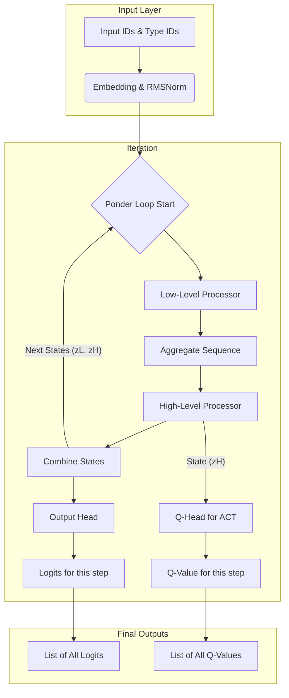

# Thinking-Bert-Hierarchical-Reasoning-Model
An Experimental attempt to achieve a thinking small Encoder Model based on https://arxiv.org/pdf/2412.13663 (ModernBert) and  https://arxiv.org/abs/2506.21734 (HierarchicalReasoningModel)

## ⚙️ Model Architecture: Information Flow

The `HierarchicalBert` model processes information through a two-level, iterative refinement loop. This diagram shows how data moves through the model's components during its "thinking" process.



```mermaid
graph TD
    A[Input: The capital of France is <MASK>] --> B{Tokenization};
    B --> C{Locate Mask Index};
    C --> D{Pad to Max Length};
    D --> E[Prepare Tensors: input_ids, attention_mask, token_type_ids];
    E --> F{model(..., N, T)};

    subgraph "HierarchicalBert Model Inference"
        F --> G[Iterative Pondering (N steps)];
        G --> H[Final Logits List];
    end

    H --> I{Select Final Logits};
    I --> J{Extract Logits at Mask Index};
    J --> K{Find Highest Logit (Argmax)};
    K --> L[Decode Predicted Token ID];
    L --> M[Output: "The capital of France is Paris."];

    style A fill:#f9f,stroke:#333,stroke-width:2px
    style M fill:#bbf,stroke:#333,stroke-width:2px
```
