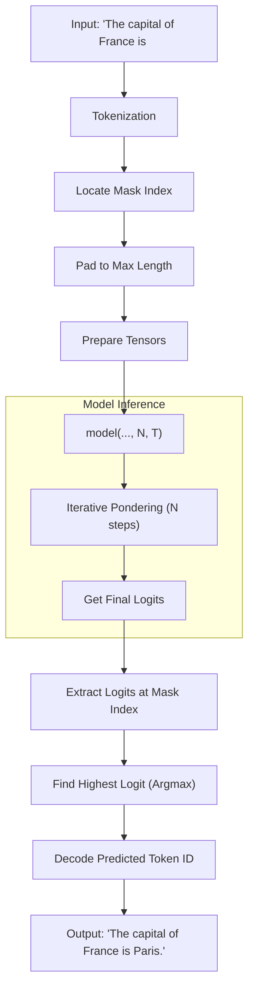

# Thinking-Bert-Hierarchical-Reasoning-Model
An Experimental attempt to achieve a thinking small Encoder Model based on https://arxiv.org/pdf/2412.13663 (ModernBert) and  https://arxiv.org/abs/2506.21734 (HierarchicalReasoningModel)

## ⚙️ Model Architecture: Information Flow

The `HierarchicalBert` model processes information through a two-level, iterative refinement loop. This diagram shows how data moves through the model's components during its "thinking" process.

## ⚙️ Model Information Flow: Inference

## ⚙️ Benchmarks

## ⚙️ Different Sizes models

## ⚙️ Multi token prediction

## ⚙️ Hardware requirements

